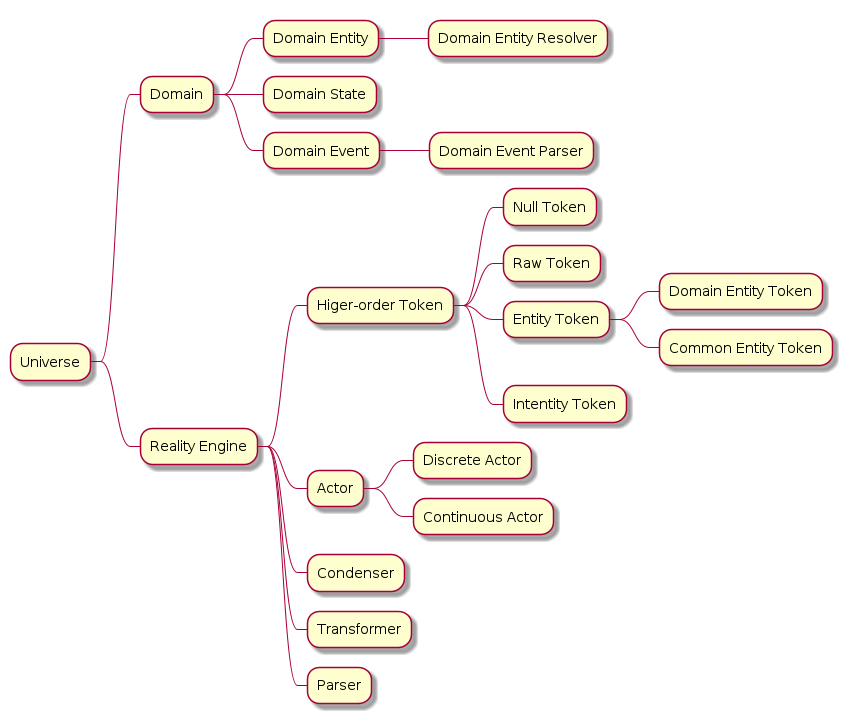

# Condenser Concepts

This document outlines common concepts in the `Condenser` mental model.

- [Condenser Concepts](#condenser-concepts)
  - [Background](#background)
  - [Universe](#universe)
    - [Domain](#domain)
    - [Domain Entity](#domain-entity)
    - [Domain Entity Resolver](#domain-entity-resolver)
    - [Domain State](#domain-state)
    - [Domain Event](#domain-event)
    - [Domain Event Processor](#domain-event-processor)
  - [Reality Engine](#reality-engine)
    - [Tokens](#tokens)
      - [Raw Token](#raw-token)
      - [Entity Token](#entity-token)
      - [Intentity Token](#intentity-token)
      - [Null Token](#null-token)
      - [Higher-order Token](#higher-order-token)
    - [Actors](#actors)
      - [Discrete Actors](#discrete-actors)
      - [Continuous Actors](#continuous-actors)
    - [Condenser](#condenser)
    - [Transformer](#transformer)
    - [Parser](#parser)

## Background

Condenser is a mental model, API description language, and framework for scaffolding natural language understanding (NLU) experiences. The condenser framework is geared towards command and query scenarios where a user wants to expedite specific actions with their voice. Context is critical when designing human-machine interfaces, thus the condenser mental model is designed to be domain-oriented in nature.

Before we dive into each concept, please look over this mind map to see how these concepts are related to one another.

## Universe

In the context of condenser, the universe is the source of truth for

### Domain

### Domain Entity

### Domain Entity Resolver

### Domain State

### Domain Event

### Domain Event Processor

## Reality Engine

### Tokens

#### Raw Token

#### Entity Token

#### Intentity Token

#### Null Token

#### Higher-order Token

### Actors

#### Discrete Actors

#### Continuous Actors

### Condenser

### Transformer

A transformer takes a series of tokens and transforms them. Transformation may entail changing a token's type, annotating tokens with additional information, or combining multiple tokens into one.

Generally, transforms will map one token space into another token space. Suppose our universe, U, contains tokens `{A, B, C, D}`. Also, suppose we have a token spaces `X = {A, B}` and `Y = {C, D}`. Then we could define a transform `T: X -> Y` which will map elements from types `{A, B}` to types `{C, D}`. It is worth noting that transforms may map a space to itself or a superset of itself; the domain and codomain of a transform need not be mutually exclusive.

Use of transformers involves performing search over tokens for entities with semantics within the domain of our universe. How search is performed and how tokens are mapped from one space to another depends on the needs of the user and the context.

### Parser

`higher-order token -> domain event`
